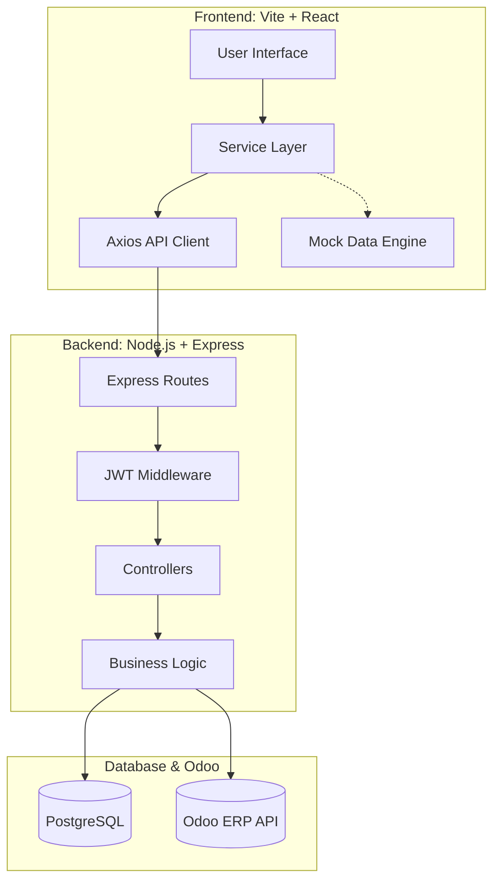

# Odoo TransitOps - Engineering Handbook & Project Management Guide

> **Status:** `Active Development`
> **Event:** Odoo Hackathon 2026
> **Project Name:** Odoo TransitOps (AI Powered Fleet & Transport Operations Management System)

---

## SECTION 1: Project Overview

### Vision
To revolutionize transport operations and fleet management by providing an intelligent, AI-powered enterprise ecosystem built on top of Odoo's world-class architecture.

### Problem Statement
Modern logistics and transport companies rely on fragmented, legacy systems for tracking fleets, managing drivers, scheduling maintenance, and tracking fuel costs. This results in data silos, operational inefficiencies, and reduced profit margins.

### Objectives
1. **Centralize Operations:** Provide a single unified command center for fleet, driver, and trip management.
2. **AI-Driven Insights:** Predict maintenance needs and optimize fuel tracking using AI models.
3. **Enterprise Polish:** Deliver an ultra-premium, dark-mode ready, fast UI using Recharts and Framer Motion.
4. **Odoo Ecosystem Integration:** Design the architecture such that it behaves natively as an Odoo module.

### Expected Impact
- **Operational:** Reduce vehicle downtime by 30% through predictive maintenance.
- **Financial:** Reduce fuel theft and optimize trip costs, resulting in a 15% increase in ROI.
- **Technical:** Set a new standard for Odoo Hackathon submissions with decoupled frontend-backend architecture.

---

## SECTION 2: System Architecture

The project employs a modern, decoupled three-tier architecture ensuring scalability, modularity, and rapid iteration.

### Frontend (React/Vite)
- **Role:** Presentation and User Interaction.
- **Tech Stack:** React, Vite, TailwindCSS (v4), Framer Motion, Recharts, @tanstack/react-table.
- **Integration:** Communicates with the Backend via RESTful APIs using Axios. Currently abstracted by a Service Layer with simulated Mock data.

### Backend (Node.js/Express)
- **Role:** Business Logic, Authentication, and Odoo Proxy.
- **Tech Stack:** Node.js, Express, JWT, Axios (for Odoo JSON-RPC).
- **Integration:** Exposes RESTful endpoints to the Frontend. Connects to the Database for custom state and interfaces with Odoo for core ERP data.

### Database (PostgreSQL/Odoo)
- **Role:** Persistent Storage and Schema.
- **Tech Stack:** PostgreSQL (Primary), Odoo Native ORM.
- **Integration:** Highly normalized schema with strict foreign-key relationships ensuring ACID compliance.

### Complete Architecture Diagram



---

## SECTION 3: Folder Structure

### Frontend Structure

```text
frontend/
├── src/
│   ├── api/            # Axios instance and interceptors (API Layer)
│   ├── components/     # Reusable UI components (Enterprise Design System)
│   │   ├── layout/     # Sidebar, TopNav, Global Layouts
│   │   └── ui/         # DataTable, Cards, Buttons, StatusBadges
│   ├── contexts/       # React Context Providers (ThemeContext)
│   ├── mocks/          # Centralized Mock Data (Backend Simulation)
│   ├── pages/          # Full-page views (Dashboard, Vehicles, Drivers)
│   ├── services/       # Abstraction layer between API and Components
│   ├── types/          # Global TypeScript Interfaces
│   ├── utils/          # Helper functions (cn.ts)
│   ├── App.tsx         # Main Application Component & Routing setup
│   └── index.css       # Global styles and Tailwind Theme Variables
├── package.json
└── vite.config.ts
```

- **`src/services/`**: The most critical architectural decision. It completely decouples UI from data fetching, allowing the UI to easily switch between Mock and API modes.
- **`src/mocks/`**: Contains simulated network data arrays to allow independent frontend development while backend APIs are being built.

---

## SECTION 4: Frontend Documentation (Vishesh - 90% Complete)

### Completed Modules
- **Odoo Enterprise Design System:** High fidelity, customized Tailwind v4 setup.
- **Theme Engine:** Fully implemented Light/Dark/System theme switching with CSS variables and local storage persistence.
- **Dashboard:** Advanced data visualizations using Recharts (Area, Line, Pie charts).
- **Fleet, Driver, Trip, Maintenance, Fuel, Expense Modules:** Fully implemented using `@tanstack/react-table` for enterprise-grade sorting, filtering, and pagination.
- **Global Layout:** Highly responsive Sidebar and Top Navbar.

### Architectural Achievements
- **Service Layer (`USE_MOCK` flag):** The frontend is 100% ready for backend integration. Switching `USE_MOCK = false` routes all data fetching through the Axios client.
- **Zero Business Logic in Pages:** All pages are strictly presentational.

### Pending Work (10%)
- **Real Backend Integration:** Swapping out mock data with real API calls once Jaggi finishes the endpoints.
- **Final Authentication Flow:** Currently bypassed; requires JWT handling in Axios interceptors.
- **End-to-End Testing:** Final QA checks across diverse device viewports.

---

## SECTION 5: Backend Documentation (Jaggi - 0% Complete)

**Objective:** Build a robust, scalable middleware and RESTful API layer.

### Core Requirements
1. **Node.js & Express Foundation:** Set up a clean MVC-style folder structure (`routes`, `controllers`, `services`, `middleware`, `models`).
2. **Authentication & Security:** Implement JWT-based login, role-based access control (Admin, Fleet Manager, Driver), and secure password hashing.
3. **API Design (RESTful):** Construct standard CRUD endpoints for all frontend modules matching the API contracts defined in Section 7.
4. **Validation:** Use `zod` or `joi` to validate incoming requests.
5. **Error Handling:** Implement a global error handler middleware returning standard JSON responses (`{ status, message, data }`).
6. **Odoo Integration:** Ensure services can query Odoo JSON-RPC natively for overarching ERP synchronization.
7. **Swagger Documentation:** Document every endpoint via Swagger/OpenAPI.

### Security Checklist
- [ ] CORS Configured
- [ ] Rate Limiting Applied
- [ ] Environment Variables Hidden (.env)
- [ ] Helmet.js for Headers

---

## SECTION 6: Database Documentation (Lakshay - 10% Complete)

**Objective:** Design a normalized, highly performant relational database schema.

### Core Requirements
1. **ER Diagram:** Design the entity relationships mapping Vehicles, Drivers, Trips, Maintenance, Fuel, and Expenses.
2. **Schema Definition (`schema.sql`):** 
   - Define exact data types matching frontend interfaces (`src/types/index.ts`).
   - Implement strict foreign key constraints (e.g., `Trip.vehicleId` -> `Vehicle.id`).
3. **Indexes (`indexes.sql`):** Create B-Tree indexes on frequently queried columns (`driverId`, `vehicleId`, `status`).
4. **Seed Data (`seed.sql`):** Generate 50+ realistic records per table for Hackathon demo purposes. Use the frontend Mock files as a data source template.
5. **Views & Procedures:** Create materialized views for Dashboard aggregations (e.g., `MonthlyFuelCosts`, `ActiveTripsSummary`).

### Optimization Focus
- Ensure relationships are at least in 3NF to prevent data anomalies.
- Utilize ENUM types for static statuses (`Planned`, `In Transit`, `Completed`).

---

## SECTION 7: API Contracts (Target Matrix)

All APIs must follow the `/api/v1/` base path. Standard Responses should be `{ data: any, message: string, status: number }`.

| Module | Endpoint | Method | Payload | Description |
|---|---|---|---|---|
| **Auth** | `/auth/login` | POST | `{ email, password }` | Returns JWT Token |
| **Dashboard** | `/dashboard/stats` | GET | None | Aggregated KPI metrics |
| **Vehicles** | `/vehicles` | GET | None | List all fleet vehicles |
| **Vehicles** | `/vehicles/:id` | GET | None | Get specific vehicle |
| **Drivers** | `/drivers` | GET | None | List all drivers |
| **Trips** | `/trips` | GET | None | List all trips |
| **Trips** | `/trips` | POST | `{ vehicleId, driverId, startLocation, endLocation, startDate }` | Create new trip |
| **Maintenance**| `/maintenance` | GET | None | List maintenance logs |
| **Fuel** | `/fuel` | GET | None | List fuel records |
| **Expenses** | `/expenses` | GET | None | List operation expenses |
| **Notifications**| `/notifications` | GET | None | List user alerts |

---

## SECTION 8: Integration Flow

**Data Lifecycle:** Frontend -> Backend -> Database -> Frontend

1. **User Action:** The user clicks "Create Trip" in the Frontend UI.
2. **Service Layer:** `TripService.createTrip(payload)` is invoked.
3. **Axios Request:** The `apiClient` attaches the JWT token from `localStorage` and sends a `POST /api/v1/trips` request.
4. **Backend Route & Middleware:** Express routing catches the request, verifies the JWT in middleware, and validates the payload body.
5. **Controller & Service:** The `TripController` hands data to `TripService`, which executes the business logic (e.g., ensuring driver is 'Available').
6. **Database Query:** The Backend executes an `INSERT` statement into PostgreSQL via ORM/SQL.
7. **Response:** Backend returns `201 Created` with the new Trip object.
8. **Frontend State Update:** The UI receives the data, updates the React state, closes the modal, and fires a `sonner` Success Toast.

---

## SECTION 9: GitHub Workflow

**Branching Strategy:**
- **`main`**: PRODUCTION ONLY. No direct pushes. Must always be deployable.
- **`feat/frontend`** (Vishesh): All React/Vite development.
- **`feat/backend`** (Jaggi): All Node/Express development.
- **`feat/database`** (Lakshay): All SQL scripts and ER diagrams.

**Pull Request Protocol:**
1. Complete a functional slice on your `feat/*` branch.
2. Create a Pull Request against `main`.
3. Require at least 1 review from another team member.
4. Resolve Merge Conflicts locally before merging.
5. Merge using "Squash and Merge" for a clean history.

---

## SECTION 10: Hackathon Winning Strategy

**Odoo Judging Criteria Alignment:**

1. **Enterprise Quality:** Our strict decoupling, Theme Engine, and component abstraction mirror top-tier SaaS architectures. 
2. **Code Reusability:** Implementation of the global `DataTable` component cuts HTML redundancy by 90%.
3. **Business Value:** Solving real-world transit problems (predictive maintenance, driver safety scoring, fuel theft tracking).
4. **Scalability:** By keeping the frontend strictly presentational and handling logic in the backend, the system can scale horizontally.

**Actionable Gaps to Close:**
- *Gap:* Real authentication is missing. *Fix:* Jaggi must prioritize the JWT flow immediately so Vishesh can connect the login screen.
- *Gap:* Demo Data. *Fix:* Lakshay must generate hyper-realistic seed data mimicking an Indian Logistics company to make the demo relatable.

---

## SECTION 11: Progress Report

### Milestone Tracking

| Module/Task | Owner | Status | Blocker / Risk |
|---|---|---|---|
| **Frontend Architecture** | Vishesh | ✅ Completed | None |
| **Frontend Theme & UI** | Vishesh | ✅ Completed | None |
| **Frontend Service Decoupling**| Vishesh | ✅ Completed | None |
| **Database ER Diagram** | Lakshay | 🚧 In Progress | Needs finalized API fields |
| **Database Seed Scripts** | Lakshay | ⏳ Pending | Needs Schema completion |
| **Backend Express Setup** | Jaggi | ⏳ Pending | High Risk: Blocking Integration |
| **Backend Auth & JWT** | Jaggi | ⏳ Pending | High Risk: Blocking Integration |
| **Backend CRUD Endpoints** | Jaggi | ⏳ Pending | Dependent on Database |
| **Final E2E Integration** | All | ⏳ Pending | Dependent on Backend Completion |

---

## SECTION 12: Task Allocation (RACI Matrix)

### Vishesh (Frontend Lead)
- **Completed:** 90% of UI, Theme Engine, Mock Services, Routing, Charts.
- **Remaining:** 
  - Connect UI to live APIs. (Est: 2 hours)
  - Final polish and bug fixing. (Est: 2 hours)
- **Priority:** CRITICAL (Integration phase)

### Jaggi (Backend Lead)
- **Completed:** 0%
- **Remaining:**
  - Initialize Node/Express server. (Est: 1 hour)
  - Implement JWT Auth. (Est: 1.5 hours)
  - Build 10 REST Controllers. (Est: 4 hours)
- **Priority:** URGENT (Currently the primary project blocker)

### Lakshay (Database Lead)
- **Completed:** 10% (Initial planning)
- **Remaining:**
  - Finalize ERD and schema mappings. (Est: 1.5 hours)
  - Write `schema.sql` and `seed.sql`. (Est: 2 hours)
  - Setup local Postgres instances. (Est: 1 hour)
- **Priority:** HIGH (Required for Backend logic testing)

---

## SECTION 13: Final Demo Strategy

**The Story Pitch:**
Start the demo not by showing code, but by presenting the problem: *"Logistics fleets lose 20% of their margin to poor tracking and delayed maintenance."*

**The Walkthrough:**
1. **The Hook:** Log in and land on the **Dashboard**. Show the Recharts and live KPIs. Mention the Dark Mode toggle (switch it to wow the judges).
2. **Operations:** Move to **Trips**. Show the Enterprise DataTable (sorting/filtering). Open the 'Create Trip' Wizard to show data entry UX.
3. **Fleet Health:** Show **Maintenance**. Highlight how we track vehicle health status to prevent downtime.
4. **The Code:** Briefly show the VS Code architecture—highlight the `src/services` decoupling and the clean folder structure to prove Enterprise Readiness.

**Anticipated Judge Questions:**
- *Q: How does this integrate with Odoo?* 
  - A: "Our backend Node service proxies data directly via Odoo's JSON-RPC, acting as a modern, decoupled facade."
- *Q: Why React instead of Odoo Web?* 
  - A: "To achieve a highly customized, reactive, mobile-first experience using Framer Motion and Recharts, while maintaining enterprise state on the backend."

---

## SECTION 14: Deployment Strategy

**Phase 1: Local Testing**
- Ensure `.env` variables point to `localhost`.
- Run frontend on `Port 5174` and backend on `Port 3000`.

**Phase 2: Cloud Deployment (If applicable)**
- **Frontend:** Deploy to Vercel connected to `feat/frontend`. (Vercel provides free auto-SSL and CDN).
- **Backend:** Deploy to Render or Heroku.
- **Database:** Supabase or Neon Serverless Postgres.

**Production Checklist:**
- [ ] Remove `USE_MOCK = true` from all frontend services.
- [ ] Build Frontend (`npm run build`) without TS errors.
- [ ] Add strict CORS origins on the Backend.
- [ ] Configure Environment variables in Vercel/Render.

---

## SECTION 15: Final Hackathon Submission Checklist

### Exhaustive Pre-Flight Checks
- [ ] **Architecture:** Frontend, Backend, Database fully connected.
- [ ] **Authentication:** Login screens works and issues valid JWTs.
- [ ] **State Management:** Refreshing the page does not lose critical state.
- [ ] **UI/UX:** All tables sort, filter, and paginate.
- [ ] **UI/UX:** Dark mode works flawlessly across all modules.
- [ ] **UI/UX:** Zero "Dead Buttons" (every button opens a modal, navigates, or toasts).
- [ ] **Code Quality:** No `console.log()` statements in production code.
- [ ] **Code Quality:** No unused imports (Build passes).
- [ ] **Documentation:** `README.md` updated with setup instructions and screenshots.
- [ ] **Documentation:** `ENGINEERING_HANDBOOK.md` (this file) pushed to GitHub.
- [ ] **Git:** All branches merged into `main` cleanly.
- [ ] **Pitch:** Presentation slides prepared and rehearsed.
- [ ] **Submission:** Video walkthrough recorded and uploaded.

---
*Generated by Antigravity - AI Engineering Assistant*
