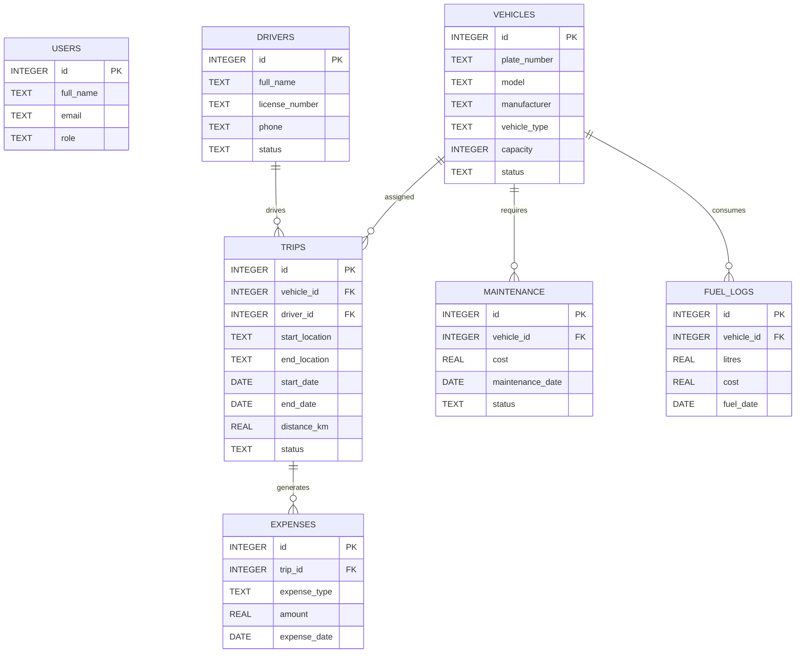

# TransitOps Entity Relationship Diagram

```mermaid
erDiagram

    USERS {
        INTEGER id PK
        TEXT full_name
        TEXT email
        TEXT role
    }

    DRIVERS {
        INTEGER id PK
        TEXT full_name
        TEXT license_number
        TEXT phone
        TEXT status
    }

    VEHICLES {
        INTEGER id PK
        TEXT plate_number
        TEXT model
        TEXT manufacturer
        TEXT vehicle_type
        INTEGER capacity
        TEXT status
    }

    TRIPS {
        INTEGER id PK
        INTEGER vehicle_id FK
        INTEGER driver_id FK
        TEXT start_location
        TEXT end_location
        DATE start_date
        DATE end_date
        REAL distance_km
        TEXT status
    }

    MAINTENANCE {
        INTEGER id PK
        INTEGER vehicle_id FK
        REAL cost
        DATE maintenance_date
        TEXT status
    }

    FUEL_LOGS {
        INTEGER id PK
        INTEGER vehicle_id FK
        REAL litres
        REAL cost
        DATE fuel_date
    }

    EXPENSES {
        INTEGER id PK
        INTEGER trip_id FK
        TEXT expense_type
        REAL amount
        DATE expense_date
    }

    VEHICLES ||--o{ TRIPS : assigned
    DRIVERS ||--o{ TRIPS : drives
    VEHICLES ||--o{ MAINTENANCE : requires
    VEHICLES ||--o{ FUEL_LOGS : consumes
    TRIPS ||--o{ EXPENSES : generates
```