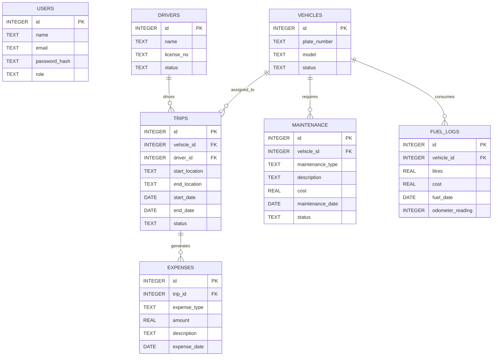

# 🗄️ TransitOps Database ER Diagram

The following Entity Relationship Diagram represents the database structure of the **TransitOps Fleet Management System**.

---

## 📌 Relationship Summary

| Parent | Child | Relationship |
|---------|--------|--------------|
| VEHICLES | TRIPS | One Vehicle → Many Trips |
| DRIVERS | TRIPS | One Driver → Many Trips |
| VEHICLES | MAINTENANCE | One Vehicle → Many Maintenance Records |
| VEHICLES | FUEL_LOGS | One Vehicle → Many Fuel Logs |
| TRIPS | EXPENSES | One Trip → Many Expenses |

---

## Database Tables

- 👤 USERS
- 🚚 VEHICLES
- 👨‍✈️ DRIVERS
- 🛣️ TRIPS
- 🔧 MAINTENANCE
- ⛽ FUEL_LOGS
- 💰 EXPENSES

---

### Developed By

**Lakshya Dogra**  
Database Developer • Odoo Hackathon 2026